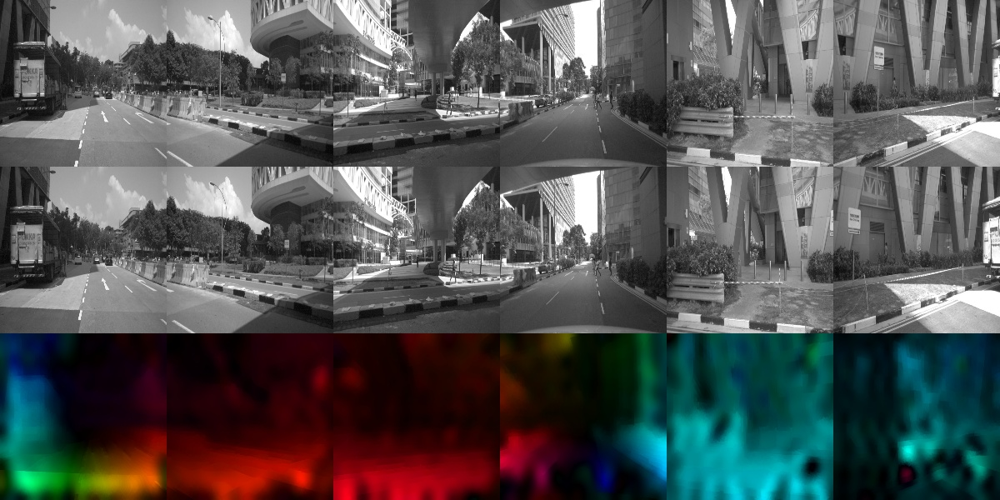

---

# Ego-Motion Estimation using Optical Flow from Multi-Camera Setup  


## Authors  
** Parth Mahajan, Utkarsh Rai , Ajith Sylvester, Kumar Selvakumaran, Sakshi Bhatia**  
Northeastern University  

## Overview  
This project investigates ego-motion estimation using optical flow equations derived from a multi-camera setup. Traditional methods rely on feature matching, which can be unreliable in feature-sparse or noisy environments. Optical flow-based techniques offer a direct approach to motion estimation but suffer from scale ambiguity when using single-camera setups. Our method leverages a multi-camera system to improve the robustness and accuracy of ego-motion estimation.  

## Key Contributions  
- **Scale-Free Motion Equations**: Derived equations that eliminate depth dependence, allowing ego-motion estimation without explicit range measurements.  
- **Geometric Justification**: Provided mathematical and geometric reasoning linking optical flow to rotational and translational velocities.  
- **Real-World Evaluation**: Implemented and tested the algorithm using the NuScenes dataset, highlighting challenges like noise sensitivity and degenerate cases in multi-camera configurations.  

## Motivation  
Traditional ego-motion estimation methods, such as Visual Odometry (VO) and Simultaneous Localization and Mapping (SLAM), rely heavily on feature matching and depth estimation, which can be computationally expensive and unreliable in dynamic environments. Multi-camera setups offer a more comprehensive view, improving motion estimation accuracy while mitigating the limitations of single-camera approaches.  

## Approach  
1. **Dataset**: Used the [NuScenes dataset](https://www.nuscenes.org/) containing 1.4 million images captured from six cameras mounted on an autonomous vehicle.  
2. **Mathematical Formulation**:  
   - Defined ego-motion as the pair of angular and translational velocities in a coordinate frame aligned with the robot but static relative to the world.  
   - Derived relationships between optical flow, camera motion, and ego-motion.  
3. **Implementation**:  
   - Computed dense optical flow from sequential frames.  
   - Processed optical flow fields to extract motion components.  
   - Formulated and optimized a loss function using PyTorch-based gradient descent.  
4. **Optimization**:  
   - Used Adagrad optimizer for stable convergence.  
   - Tested configurations with multiple cameras to reduce errors and handle degenerate cases.  

## Results  
- **Experimental Setup**: Evaluated performance on the NuScenes-Mini.v1 dataset using different camera configurations:  
  - 6-camera setup  
  - 2-camera setups (Front-Back & Front-Left/Front-Right)  
- **Findings**:  
  - The 6-camera configuration provided the best results, reducing root mean square (RMS) errors in translation and rotation estimation.  
  - High translation errors persisted due to noisy optical flow.  
  - Degenerate cases occurred where translation magnitude estimation was unreliable.  


## Challenges & Future Work  
- **Noise Sensitivity**: High sensitivity to noise in optical flow computation.  
- **Degenerate Cases**: Cases where only rotational motion could be reliably estimated.  
- **Future Improvements**:  
  - Enhancing the loss function to better handle noise.  
  - Exploring additional datasets to improve generalization.  
  - Integrating additional sensors (IMU, Lidar) for fusion-based motion estimation.  

## Getting Started  

### Prerequisites  
- Python 3.8+  
- PyTorch  
- OpenCV  
- NumPy  
- Matplotlib  

### Installation  
1. Clone the repository:  
   ```bash
   git clone https://github.com/your-username/ego-motion-multi-camera.git
   cd ego-motion-multi-camera
   ```  
2. Install dependencies:  
   ```bash
   pip install -r requirements.txt
   ```  

### Running the Code  
1. **Download NUSCENE Dataset**:  
   ```https://www.nuscenes.org/download
   ```  
2. **Follow the Notebook MULTICAM EGO MOTION ESTIMATION IPYNB**:  

### Repository Structure  
```
├── data/                  # NuScenes dataset (not included in repo)
├── notebooks/             # Jupyter notebooks for analysis
├── results/               # Experimental results
├── README.md              # Project documentation
└── requirements.txt       # Dependencies
```  

## References  
- Tsao et al., "Ego-Motion Estimation Using Optical Flow Fields Observed from Multiple Cameras"  
- NuScenes dataset ([https://www.nuscenes.org/](https://www.nuscenes.org/))  

---

